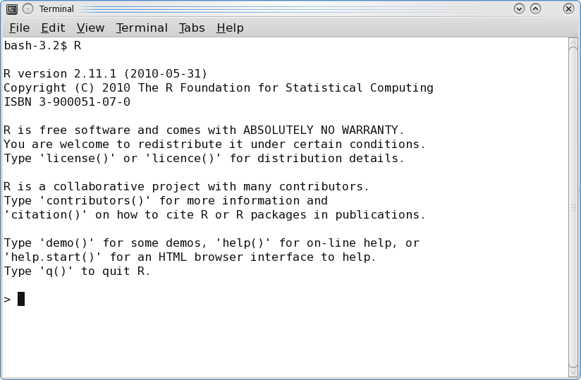
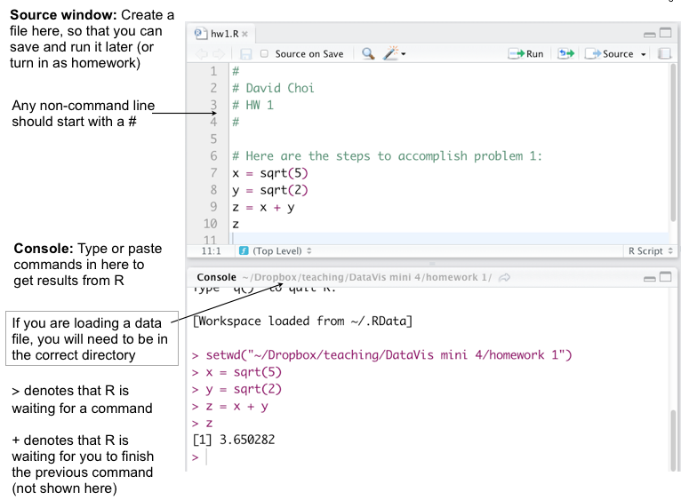
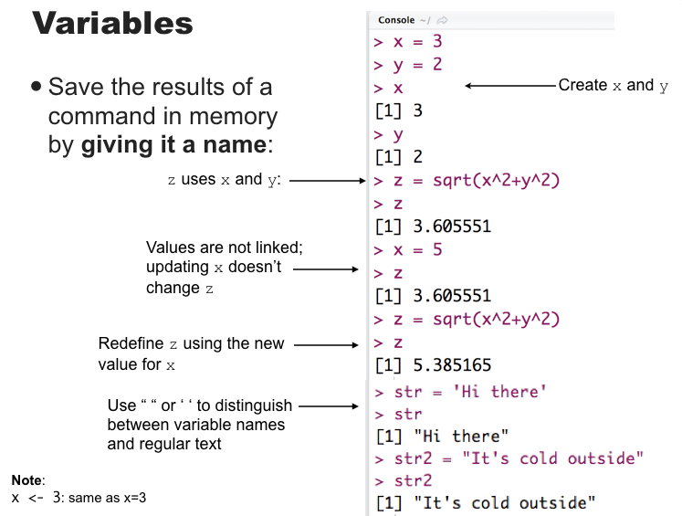
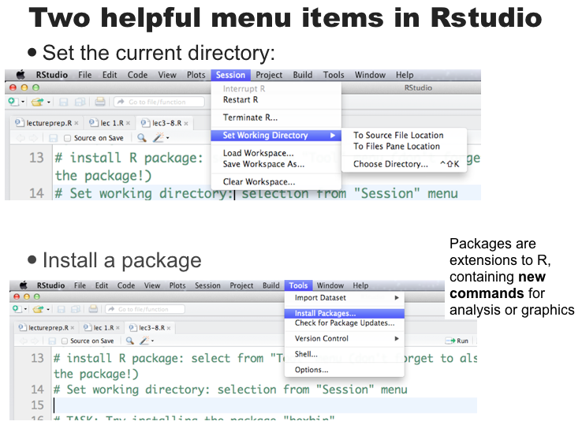

Info about me
=====================
 * Contact
     * Nathan VanHoudnos (van-HOD-ness)
     * nathanvan@northwestern.edu
     * http://www.stat.cmu.edu/~nmv (currently down)
     
 * CV highlights
     * Programmer since late 90's 
     * UNIX System Administrator (High Performance Computing) in mid 2000's
     * PhD in Statistics and Public Policy, Carnegie Mellon University (2014)
     * Currently post-doc at NU Institute for Policy Research 

Objectives for today
=========================

Student will be able to: 

 * navigate R Studio and perform simple tasks in the R language. 
 * knit an R Markdown document with an (i) equation, (ii) figure, and (iii) English prose.
 * know where to seek help both within R and within the wider world. 
 
> Special thanks to Prof. Alexandra Chouldechova for providing her R intro materials via a  [Creative Commons Attribution-NonCommercial-ShareAlike 4.0 International License](http://creativecommons.org/licenses/by-nc-sa/4.0/). This lecture draws heavily from hers and is likewise licensed. 

The R Console
===================
Basic interaction with R is by typing in the **console**, a.k.a. **terminal** or **command-line**



- You type in commands, R gives back answers (or errors)

- Menus and other graphical interfaces are extras built on top of the console

- We will use **RStudio** in this class


RStudio: Panes
===========================


***
Rstudio has 4 main windows ('panes'):

1. The __Source__ pane: create a file that you can save and run later
2. The __Console__ pane: type or paste in commands to get output from R
3. The __Workspace/History__ pane: see a list of variables or previous commands
4. The __Files/Plots/Packages/Help__ pane: see plots, help pages, and other items in this window.


RStudio: Source and Console panes
===================================


RStudio: Console
========================================


RStudio: Toolbar
=========================================


###R Markdown
- R Markdown allows the user to integrate R code into a report

- **This was Homework 0**. 

- When data changes or code changes, so does the report

- No more need to copy-and-paste graphics, tables, or numbers

- Creates __reproducible__ reports
    * Anyone who has your R Markdown (.Rmd) file and input data can re-run your analysis and get the exact same results (tables, figures, summaries)
    * Can output report in HTML (default), Microsoft Word, or PDF

###R Markdown -- $\LaTeX$

Markdown allows you to use $\LaTeX$ to typeset math.

```{r,eval=FALSE}
$$ c = \sqrt{a^2 + b^2 }$$
```
$$ c = \sqrt{a^2 + b^2 }$$

Or, more germane to the book (p. 11) 
```{r,eval=FALSE}
$$
\widehat{Y} = \widehat{\beta_0} + \sum_{j=1}^{p} X_j \widehat{\beta}_{j}
$$
```
$$
\widehat{Y} = \widehat{\beta}_0 + \sum_{j=1}^{p} X_j \widehat{\beta}_{j}
$$

Checkout http://www.latex-tutorial.com/tutorials/quick-start/ for details. Especially [this one](http://www.latex-tutorial.com/tutorials/beginners/lesson-4/).

###In-class exercise: Hello world!

1. Open **RStudio** on your machine

2. File > New File > R Markdown ...
3. Change `summary(cars)` in the first code block to `print("Hello world!")`
4. Click `Knit HTML` to produce an HTML file.
5. Save your Rmd file as `helloworld.Rmd`
6. On line 9, add a new paragraph that says: `Consider the following model: ` \$\$ `Y = X\beta + \epsilon ` \$\$. 
7. Click `Knit HTML` to produce an HTML file.

> Your labs and homework assignments will all take the form of a single Rmd file, which you will edit to include your solutions and then submit on Canvas.

###Basics: the class in a nutshell
- Everything we'll do comes down to applying **functions** to **data**

- **Data**:  things like 7, "seven", $7.000$, the matrix $\left[ \begin{array}{ccc} 7 & 7 & 7 \\ 7 & 7 & 7\end{array}\right]$

- **Functions**: things like $\log{}$, $+$ (two arguments), $<$ (two), $\mod{}$ (two), `mean` (one)

> A function is a machine which turns input objects (**arguments**) into an output object (**return value**), possibly with **side effects**, according to a definite rule

###Data building blocks

You'll encounter different kinds of data types

- **Booleans** Direct binary values: `TRUE` or `FALSE` in R
- **Integers**: whole numbers (positive, negative or zero)
- **Characters** fixed-length blocks of bits, with special coding;
**strings** = sequences of characters
- **Floating point numbers**: a fraction (with a finite number of bits) times an exponent, like $1.87 \times {10}^{6}$
- **Missing or ill-defined values**: `NA`, `NaN`, etc.


###Operators (functions)
You can use R as a very, very fancy calculator

Command | Description
--------|-------------
`+,-,*,\` | add, subtract, multiply, divide
`^` | raise to the power of
`%%` | remainder after division (ex: `8 %% 3 = 2`)
`( )` | change the order of operations
`log(), exp()` | logarithms and exponents (ex: `log(10) = 2.302`)
`sqrt()` | square root
`round()` | round to the nearest whole number (ex: `round(2.3) = 2`)
`floor(), ceiling()` | round down or round up 
`abs()` | absolute value

###

```{r}
7+5 # Addition
7-5 # Subtraction
7*5 # Multiplication
7^5 # Exponentiation
```
###
```{r}
7/5 # Division
7 %% 5 # Modulus
7 %/% 5 # Integer division 
```

###Operators cont'd.
  **Comparisons** are also binary operators; they take two objects, like numbers, and give a Boolean
```{r}
7 > 5
7 < 5
7 >= 7
7 <= 5
```
###
```{r}
7 == 5
7 != 5
```

###Boolean operators
  Basically "and" and "or":
```{r}
(5 > 7) & (6*7 == 42)
(5 > 7) | (6*7 == 42)
```

<small>(will see special doubled forms, `&&` and `||`, later)</small>
  
  
###  More types
  
- `typeof()` function returns the type

- `is.`_foo_`()` functions return Booleans for whether the argument is of type _foo_

- `as.`_foo_`()` (tries to) "cast" its argument to type _foo_ --- to translate it sensibly into a _foo_-type value

<small>**Special case**: `as.factor()` will be important later for telling R when numbers are actually encodings and not numeric values.  (E.g., 1 = High school grad; 2 = College grad; 3 = Postgrad) </small>
###
```{r}
typeof(7)
is.numeric(7)
is.na(7)
```
###  
```{r}
is.character(7)
is.character("7")
is.character("seven")
is.na("seven")
```
  
###Variables
  
  We can give names to data objects; these give us **variables**
  
  A few variables are built in:
```{r}
pi
```

Variables can be arguments to functions or operators, just like constants:
```{r}
pi*10
cos(pi)
```

###Assignment operator
Most variables are created with the **assignment operator**, `<-` or `=`  

```{r}
approx.pi <- 22/7
approx.pi
diameter.in.cubits = 10
approx.pi*diameter.in.cubits
```
###
  The assignment operator also changes values:
```{r}
circumference.in.cubits <- approx.pi*diameter.in.cubits
circumference.in.cubits
circumference.in.cubits <- 30
circumference.in.cubits
```
###
  
- Using names and variables makes code: easier to design, easier to debug, less prone to bugs, easier to improve,  and easier for others to read

- Avoid "magic constants"; use named variables

- Use descriptive variable names
  - Good: `num.students <- 35`
  - Bad: `ns <- 35 `

  
  
###  The workspace
  What names have you defined values for?
```{r}
ls()
```

Getting rid of variables:
```{r}
rm("circumference.in.cubits")
ls()
```

###First data structure: vectors
  
- Group related data values into one object, a **data structure**
  
- A **vector** is a sequence of values, all of the same type

- `c()` function returns a vector containing all its arguments in order
```{r}
students <- c("Sean", "Louisa", "Frank", "Farhad", "Li")
midterm <- c(80, 90, 93, 82, 95)
```

- Typing the variable name at the prompt causes it to display

```{r}
students
```

###Indexing
- `vec[1]` is the first element, `vec[4]` is the 4th element of `vec`
```{r}
students
students[4]
```
- `vec[-4]` is a vector containing all but the fourth element
```{r}
students[-4]
```


###Vector arithmetic
  
Operators apply to vectors "pairwise" or "elementwise":
```{r}
final <- c(78, 84, 95, 82, 91) # Final exam scores
midterm # Midterm exam scores
midterm + final # Sum of midterm and final scores
(midterm + final)/2 # Average exam score
course.grades <- 0.4*midterm + 0.6*final # Final course grade
course.grades
```

###Pairwise comparisons
Is the final score higher than the midterm score?
```{r}
midterm 
final
final > midterm
```

Boolean operators can be applied elementwise:
```{r}
(final < midterm) & (midterm > 80)
```

###Functions on vectors
Command | Description
--------|------------
`sum(vec)` | sums up all the elements of `vec`
`mean(vec)` | mean of `vec`
`median(vec)` | median of `vec`
`min(vec), max(vec)` | the largest or smallest element of `vec`
`sd(vec), var(vec)` | the standard deviation and variance of `vec`
`length(vec)` | the number of elements in `vec`
`pmax(vec1, vec2), pmin(vec1, vec2)` | example: `pmax(quiz1, quiz2)` returns the higher of quiz 1 and quiz 2 for each student
`sort(vec)` | returns the `vec` in sorted order
`order(vec)` | returns the index that sorts the vector `vec`
`unique(vec)` | lists the unique elements of `vec`
`summary(vec)` | gives a five-number summary  
`any(vec), all(vec)` | useful on Boolean vectors

###Functions on vectors
```{r}
course.grades
mean(course.grades) # mean grade
median(course.grades)
sd(course.grades) # grade standard deviation
```

###More functions on vectors
```{r}
sort(course.grades)
max(course.grades) # highest course grade
min(course.grades) # lowest course grade
```
###Referencing elements of vectors
```{r}  
students
```
  
  Vector of indices:
```{r}
students[c(2,4)]
```

Vector of negative indices
```{r}
students[c(-1,-3)]
```

###More referencing

`which()` returns the `TRUE` indexes of a Boolean vector:
```{r}
course.grades
a.threshold <- 90 # A grade = 90% or higher
course.grades >= a.threshold # vector of booleans
a.students <- which(course.grades >= a.threshold) # Applying which() 
a.students
students[a.students] # Names of A students
```

###Named components
  
You can give names to elements or components of vectors
```{r}
students
names(course.grades) <- students # Assign names to the grades
names(course.grades)
course.grades[c("Sean", "Frank","Li")] # Get final grades for 3 students
```
Note the labels in what R prints; these are not actually part of the value.

## Lab 1

On Canvas. 
